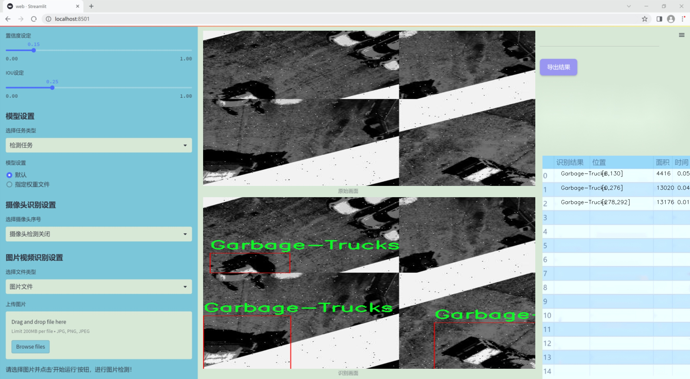
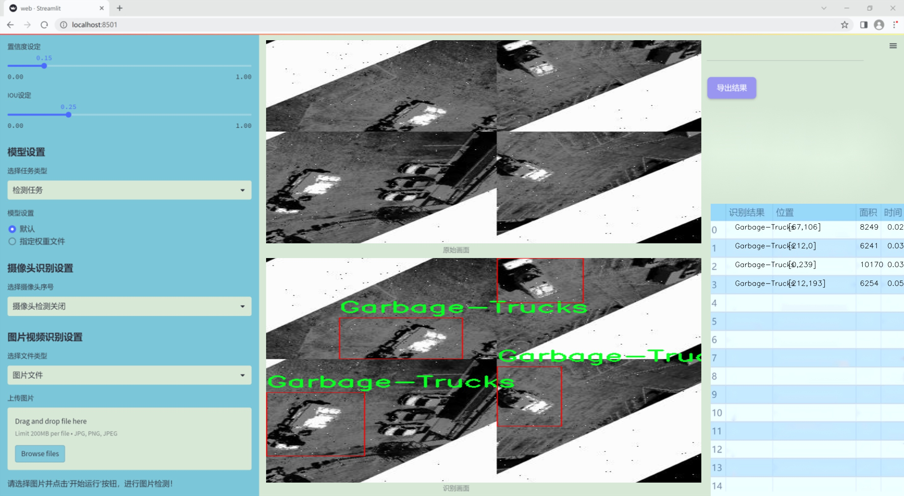
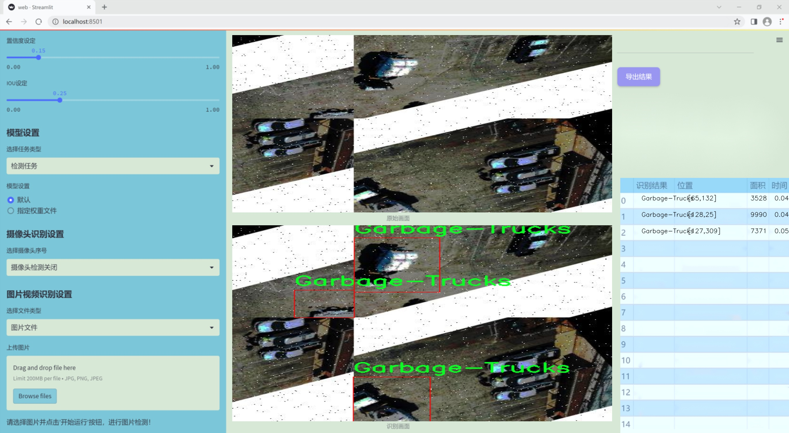
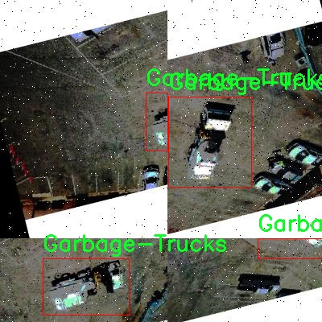
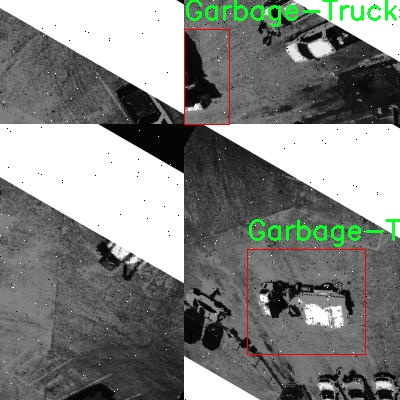
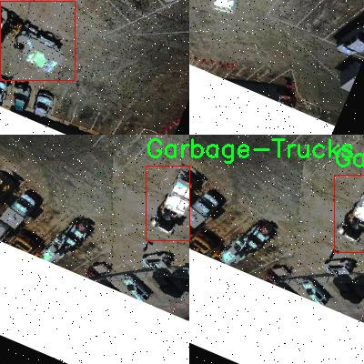
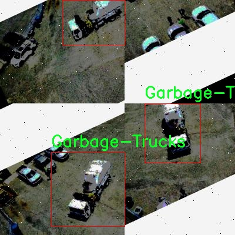
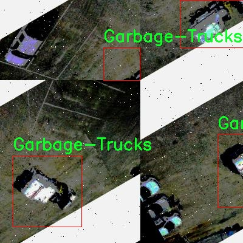

# 改进yolo11-swintransformer等200+全套创新点大全：垃圾车检测系统源码＆数据集全套

### 1.图片效果展示







##### 项目来源 **[人工智能促进会 2024.10.30](https://kdocs.cn/l/cszuIiCKVNis)**

注意：由于项目一直在更新迭代，上面“1.图片效果展示”和“2.视频效果展示”展示的系统图片或者视频可能为老版本，新版本在老版本的基础上升级如下：（实际效果以升级的新版本为准）

  （1）适配了YOLOV11的“目标检测”模型和“实例分割”模型，通过加载相应的权重（.pt）文件即可自适应加载模型。

  （2）支持“图片识别”、“视频识别”、“摄像头实时识别”三种识别模式。

  （3）支持“图片识别”、“视频识别”、“摄像头实时识别”三种识别结果保存导出，解决手动导出（容易卡顿出现爆内存）存在的问题，识别完自动保存结果并导出到tempDir中。

  （4）支持Web前端系统中的标题、背景图等自定义修改。

  另外本项目提供训练的数据集和训练教程,暂不提供权重文件（best.pt）,需要您按照教程进行训练后实现图片演示和Web前端界面演示的效果。

### 2.视频效果展示

[2.1 视频效果展示](https://www.bilibili.com/video/BV1EgSqYvEgc/)

### 3.背景

研究背景与意义

随着城市化进程的加快，城市垃圾管理问题日益凸显，垃圾车的高效调度与管理成为城市环境维护的重要环节。传统的垃圾车监控方式多依赖人工巡查，不仅效率低下，而且容易受到人为因素的影响，难以实现实时、准确的监控。因此，基于计算机视觉的自动化垃圾车检测系统应运而生，成为提升城市垃圾管理效率的重要技术手段。

近年来，深度学习技术的迅猛发展为目标检测领域带来了革命性的变化。YOLO（You Only Look Once）系列模型以其高效的实时检测能力和良好的精度，广泛应用于各类目标检测任务中。YOLOv11作为该系列的最新版本，进一步优化了模型结构，提高了检测速度和准确性，尤其适合于动态场景下的目标识别。然而，现有的YOLOv11模型在特定应用场景下的表现仍有提升空间，尤其是在复杂背景和光照变化下的垃圾车检测。

本研究旨在基于改进的YOLOv11模型，构建一个高效的垃圾车检测系统。为此，我们将使用包含1000张图像的GarBage数据集，该数据集专注于垃圾车这一特定类别，具有较高的应用价值。通过对数据集的深入分析与处理，结合改进的YOLOv11模型，我们期望能够显著提升垃圾车的检测精度和实时性，从而为城市垃圾管理提供强有力的技术支持。

此外，本研究不仅有助于推动智能监控技术在城市管理中的应用，还将为相关领域的研究提供参考，促进计算机视觉技术与实际应用场景的深度融合。通过实现高效的垃圾车检测系统，我们希望能够为城市环境的可持续发展贡献一份力量。

### 4.数据集信息展示

##### 4.1 本项目数据集详细数据（类别数＆类别名）

nc: 1
names: ['Garbage-Trucks']


该项目为【目标检测】数据集，请在【训练教程和Web端加载模型教程（第三步）】这一步的时候按照【目标检测】部分的教程来训练

##### 4.2 本项目数据集信息介绍

本项目数据集信息介绍

本项目所使用的数据集名为“GarBage”，专门用于训练和改进YOLOv11模型，以实现高效的垃圾车检测系统。该数据集的设计旨在提供一个全面而精确的训练基础，确保模型能够在各种环境和条件下准确识别垃圾车。数据集中包含的类别数量为1，具体类别为“Garbage-Trucks”。这一单一类别的设定使得数据集在专注于垃圾车检测的同时，能够更深入地捕捉该类别的多样性和复杂性。

“GarBage”数据集的构建过程中，特别注重了数据的多样性和代表性。数据集中的图像涵盖了不同类型的垃圾车，包括各种型号、颜色和外观设计，以反映现实世界中垃圾车的广泛变化。此外，数据集还考虑了不同的拍摄角度、光照条件和背景环境，确保模型在面对实际应用时具备良好的适应性和鲁棒性。这种多样化的图像来源有助于提升YOLOv11模型的泛化能力，使其能够在不同场景下保持高准确率。

为了进一步增强数据集的实用性，所有图像均经过精心标注，确保每一张图像中的垃圾车都被准确框定。这种精确的标注不仅为模型的训练提供了高质量的监督信号，也为后续的模型评估和性能分析奠定了基础。通过使用“GarBage”数据集，研究团队期望能够显著提升垃圾车检测系统的性能，从而为城市垃圾管理和环境保护提供更为有效的技术支持。











### 5.全套项目环境部署视频教程（零基础手把手教学）

[5.1 所需软件PyCharm和Anaconda安装教程（第一步）](https://www.bilibili.com/video/BV1BoC1YCEKi/?spm_id_from=333.999.0.0&vd_source=bc9aec86d164b67a7004b996143742dc)


[5.2 安装Python虚拟环境创建和依赖库安装视频教程（第二步）](https://www.bilibili.com/video/BV1ZoC1YCEBw?spm_id_from=333.788.videopod.sections&vd_source=bc9aec86d164b67a7004b996143742dc)

### 6.改进YOLOv11训练教程和Web_UI前端加载模型教程（零基础手把手教学）

[6.1 改进YOLOv11训练教程和Web_UI前端加载模型教程（第三步）](https://www.bilibili.com/video/BV1BoC1YCEhR?spm_id_from=333.788.videopod.sections&vd_source=bc9aec86d164b67a7004b996143742dc)


按照上面的训练视频教程链接加载项目提供的数据集，运行train.py即可开始训练



     Epoch   gpu_mem       box       obj       cls    labels  img_size
     1/200     20.8G   0.01576   0.01955  0.007536        22      1280: 100%|██████████| 849/849 [14:42<00:00,  1.04s/it]
               Class     Images     Labels          P          R     mAP@.5 mAP@.5:.95: 100%|██████████| 213/213 [01:14<00:00,  2.87it/s]
                 all       3395      17314      0.994      0.957      0.0957      0.0843

     Epoch   gpu_mem       box       obj       cls    labels  img_size
     2/200     20.8G   0.01578   0.01923  0.007006        22      1280: 100%|██████████| 849/849 [14:44<00:00,  1.04s/it]
               Class     Images     Labels          P          R     mAP@.5 mAP@.5:.95: 100%|██████████| 213/213 [01:12<00:00,  2.95it/s]
                 all       3395      17314      0.996      0.956      0.0957      0.0845

     Epoch   gpu_mem       box       obj       cls    labels  img_size
     3/200     20.8G   0.01561    0.0191  0.006895        27      1280: 100%|██████████| 849/849 [10:56<00:00,  1.29it/s]
               Class     Images     Labels          P          R     mAP@.5 mAP@.5:.95: 100%|███████   | 187/213 [00:52<00:00,  4.04it/s]
                 all       3395      17314      0.996      0.957      0.0957      0.0845


###### [项目数据集下载链接](https://kdocs.cn/l/cszuIiCKVNis)

### 7.原始YOLOv11算法讲解

YOLOv11是Ultralytics推出的YOLO系列最新版本，专为实现尖端的物体检测而设计。其架构和训练方法上进行了重大改进，使之不仅具备卓越的准确性和处理速度，还在计算效率上实现了一场革命。得益于其改进的主干和颈部架构，YOLOv11在特征提取和处理复杂任务时表现更加出色。在2024年9月27日，Ultralytics通过长达九小时的在线直播发布这一新作，展示了其在计算机视觉领域的革新。

YOLOv11通过精细的架构设计和优化训练流程，在保持高精度的同时，缩减了参数量，与YOLOv8m相比减少了22%的参数，使其在COCO数据集上的平均准确度（mAP）有所提升。这种效率的提高使YOLOv11非常适合部署在各种硬件环境中，包括边缘设备、云计算平台以及支持NVIDIA GPU的系统，确保在灵活性上的优势。

该模型支持广泛的任务，从对象检测、实例分割到图像分类、姿态估计和定向对象检测（OBB），几乎覆盖了计算机视觉的所有主要挑战。其创新的C3k2和C2PSA模块提升了网络深度和注意力机制的应用，提高了特征提取的效率和效果。同时，YOLOv11的改进网络结构也使之在复杂视觉任务上得以从容应对，成为各类计算机视觉任务的多功能选择。这些特性令YOLOv11在实施实时物体检测的各个领域中表现出众。
* * *

2024年9月27日，Ultralytics在线直播长达九小时，为YOLO11召开“发布会”

YOLO11 是 Ultralytics YOLO 系列实时物体检测器的最新版本，它以尖端的准确性、速度和效率重新定义了可能性。在之前 YOLO
版本的显著进步的基础上，YOLO11 在架构和训练方法方面进行了重大改进，使其成为各种计算机视觉任务的多功能选择。


##### YOLO11主要特点：

  * 增强的特征提取：YOLO11 采用了改进的主干和颈部架构，增强了特征提取能力，可实现更精确的对象检测和复杂任务性能。
  * 针对效率和速度进行了优化：YOLO11 引入了完善的架构设计和优化的训练流程，可提供更快的处理速度，并在准确度和性能之间保持最佳平衡。
  * 更少的参数，更高的准确度：借助模型设计的进步，YOLO11m 在 COCO 数据集上实现了更高的平均准确度 (mAP)，同时使用的参数比 YOLOv8m 少 22%，从而提高了计算效率，同时又不影响准确度。
  * 跨环境的适应性：YOLO11 可以无缝部署在各种环境中，包括边缘设备、云平台和支持 NVIDIA GPU 的系统，从而确保最大的灵活性。
  * 支持的任务范围广泛：无论是对象检测、实例分割、图像分类、姿势估计还是定向对象检测 (OBB)，YOLO11 都旨在满足各种计算机视觉挑战。

##### 支持的任务和模式

YOLO11 以 YOLOv8 中引入的多功能模型系列为基础，为各种计算机视觉任务提供增强的支持：

Model| Filenames| Task| Inference| Validation| Training| Export  
---|---|---|---|---|---|---  
YOLO11| yolol11n.pt, yolol11s.pt, yolol11m.pt, yolol11x.pt| Detection| ✅| ✅|
✅| ✅  
YOLO11-seg| yolol11n-seg.pt, yolol11s-seg.pt, yolol11m-seg.pt,
yolol11x-seg.pt| Instance Segmentation| ✅| ✅| ✅| ✅  
YOLO11-pose| yolol11n-pose.pt, yolol11s-pose.pt, yolol11m-pose.pt,
yolol11x-pose.pt| Pose/Keypoints| ✅| ✅| ✅| ✅  
YOLO11-obb| yolol11n-obb.pt, yolol11s-obb.pt, yolol11m-obb.pt,
yolol11x-obb.pt| Oriented Detection| ✅| ✅| ✅| ✅  
YOLO11-cls| yolol11n-cls.pt, yolol11s-cls.pt, yolol11m-cls.pt,
yolol11x-cls.pt| Classification| ✅| ✅| ✅| ✅  
  
##### 简单的 YOLO11 训练和推理示例

以下示例适用于用于对象检测的 YOLO11 Detect 模型。

    
    
    from ultralytics import YOLO
    
    # Load a model
    model = YOLO("yolo11n.pt")
    
    # Train the model
    train_results = model.train(
        data="coco8.yaml",  # path to dataset YAML
        epochs=100,  # number of training epochs
        imgsz=640,  # training image size
        device="cpu",  # device to run on, i.e. device=0 or device=0,1,2,3 or device=cpu
    )
    
    # Evaluate model performance on the validation set
    metrics = model.val()
    
    # Perform object detection on an image
    results = model("path/to/image.jpg")
    results[0].show()
    
    # Export the model to ONNX format
    path = model.export(format="onnx")  # return path to exported model

##### 支持部署于边缘设备

YOLO11 专为适应各种环境而设计，包括边缘设备。其优化的架构和高效的处理能力使其适合部署在边缘设备、云平台和支持 NVIDIA GPU
的系统上。这种灵活性确保 YOLO11 可用于各种应用，从移动设备上的实时检测到云环境中的复杂分割任务。有关部署选项的更多详细信息，请参阅导出文档。

##### YOLOv11 yaml文件

    
    
    # Ultralytics YOLO 🚀, AGPL-3.0 license
    # YOLO11 object detection model with P3-P5 outputs. For Usage examples see https://docs.ultralytics.com/tasks/detect
    
    # Parameters
    nc: 80 # number of classes
    scales: # model compound scaling constants, i.e. 'model=yolo11n.yaml' will call yolo11.yaml with scale 'n'
      # [depth, width, max_channels]
      n: [0.50, 0.25, 1024] # summary: 319 layers, 2624080 parameters, 2624064 gradients, 6.6 GFLOPs
      s: [0.50, 0.50, 1024] # summary: 319 layers, 9458752 parameters, 9458736 gradients, 21.7 GFLOPs
      m: [0.50, 1.00, 512] # summary: 409 layers, 20114688 parameters, 20114672 gradients, 68.5 GFLOPs
      l: [1.00, 1.00, 512] # summary: 631 layers, 25372160 parameters, 25372144 gradients, 87.6 GFLOPs
      x: [1.00, 1.50, 512] # summary: 631 layers, 56966176 parameters, 56966160 gradients, 196.0 GFLOPs
    
    # YOLO11n backbone
    backbone:
      # [from, repeats, module, args]
      - [-1, 1, Conv, [64, 3, 2]] # 0-P1/2
      - [-1, 1, Conv, [128, 3, 2]] # 1-P2/4
      - [-1, 2, C3k2, [256, False, 0.25]]
      - [-1, 1, Conv, [256, 3, 2]] # 3-P3/8
      - [-1, 2, C3k2, [512, False, 0.25]]
      - [-1, 1, Conv, [512, 3, 2]] # 5-P4/16
      - [-1, 2, C3k2, [512, True]]
      - [-1, 1, Conv, [1024, 3, 2]] # 7-P5/32
      - [-1, 2, C3k2, [1024, True]]
      - [-1, 1, SPPF, [1024, 5]] # 9
      - [-1, 2, C2PSA, [1024]] # 10
    
    # YOLO11n head
    head:
      - [-1, 1, nn.Upsample, [None, 2, "nearest"]]
      - [[-1, 6], 1, Concat, [1]] # cat backbone P4
      - [-1, 2, C3k2, [512, False]] # 13
    
      - [-1, 1, nn.Upsample, [None, 2, "nearest"]]
      - [[-1, 4], 1, Concat, [1]] # cat backbone P3
      - [-1, 2, C3k2, [256, False]] # 16 (P3/8-small)
    
      - [-1, 1, Conv, [256, 3, 2]]
      - [[-1, 13], 1, Concat, [1]] # cat head P4
      - [-1, 2, C3k2, [512, False]] # 19 (P4/16-medium)
    
      - [-1, 1, Conv, [512, 3, 2]]
      - [[-1, 10], 1, Concat, [1]] # cat head P5
      - [-1, 2, C3k2, [1024, True]] # 22 (P5/32-large)
    
      - [[16, 19, 22], 1, Detect, [nc]] # Detect(P3, P4, P5)
    

**YOLO11和YOLOv8 yaml文件的区别**


##### 改进模块代码

  * C3k2 

    
    
    class C3k2(C2f):
        """Faster Implementation of CSP Bottleneck with 2 convolutions."""
    
        def __init__(self, c1, c2, n=1, c3k=False, e=0.5, g=1, shortcut=True):
            """Initializes the C3k2 module, a faster CSP Bottleneck with 2 convolutions and optional C3k blocks."""
            super().__init__(c1, c2, n, shortcut, g, e)
            self.m = nn.ModuleList(
                C3k(self.c, self.c, 2, shortcut, g) if c3k else Bottleneck(self.c, self.c, shortcut, g) for _ in range(n)
            )

C3k2，它是具有两个卷积的CSP（Partial Cross Stage）瓶颈架构的更快实现。

**类继承：**

  * `C3k2`继承自类`C2f`。这表明`C2f`很可能实现了经过修改的基本CSP结构，而`C3k2`进一步优化或修改了此结构。

**构造函数（`__init__`）：**

  * `c1`：输入通道。

  * `c2`：输出通道。

  * `n`：瓶颈层数（默认为1）。

  * `c3k`：一个布尔标志，确定是否使用`C3k`块或常规`Bottleneck`块。

  * `e`：扩展比率，控制隐藏层的宽度（默认为0.5）。

  * `g`：分组卷积的组归一化参数或组数（默认值为 1）。

  * `shortcut`：一个布尔值，用于确定是否在网络中包含快捷方式连接（默认值为 `True`）。

**初始化：**

  * `super().__init__(c1, c2, n, short-cut, g, e)` 调用父类 `C2f` 的构造函数，初始化标准 CSP 组件，如通道数、快捷方式、组等。

**模块列表（`self.m`）：**

  * `nn.ModuleList` 存储 `C3k` 或 `Bottleneck` 模块，具体取决于 `c3k` 的值。

  * 如果 `c3k` 为 `True`，它会初始化 `C3k` 模块。`C3k` 模块接收以下参数：

  * `self.c`：通道数（源自 `C2f`）。

  * `2`：这表示在 `C3k` 块内使用了两个卷积层。

  * `shortcut` 和 `g`：从 `C3k2` 构造函数传递。

  * 如果 `c3k` 为 `False`，则初始化标准 `Bottleneck` 模块。

`for _ in range(n)` 表示将创建 `n` 个这样的块。

**总结：**

  * `C3k2` 实现了 CSP 瓶颈架构，可以选择使用自定义 `C3k` 块（具有两个卷积）或标准 `Bottleneck` 块，具体取决于 `c3k` 标志。

  * C2PSA

    
    
    class C2PSA(nn.Module):
        """
        C2PSA module with attention mechanism for enhanced feature extraction and processing.
    
        This module implements a convolutional block with attention mechanisms to enhance feature extraction and processing
        capabilities. It includes a series of PSABlock modules for self-attention and feed-forward operations.
    
        Attributes:
            c (int): Number of hidden channels.
            cv1 (Conv): 1x1 convolution layer to reduce the number of input channels to 2*c.
            cv2 (Conv): 1x1 convolution layer to reduce the number of output channels to c.
            m (nn.Sequential): Sequential container of PSABlock modules for attention and feed-forward operations.
    
        Methods:
            forward: Performs a forward pass through the C2PSA module, applying attention and feed-forward operations.
    
        Notes:
            This module essentially is the same as PSA module, but refactored to allow stacking more PSABlock modules.
    
        Examples:
            >>> c2psa = C2PSA(c1=256, c2=256, n=3, e=0.5)
            >>> input_tensor = torch.randn(1, 256, 64, 64)
            >>> output_tensor = c2psa(input_tensor)
        """
    
        def __init__(self, c1, c2, n=1, e=0.5):
            """Initializes the C2PSA module with specified input/output channels, number of layers, and expansion ratio."""
            super().__init__()
            assert c1 == c2
            self.c = int(c1 * e)
            self.cv1 = Conv(c1, 2 * self.c, 1, 1)
            self.cv2 = Conv(2 * self.c, c1, 1)
    
            self.m = nn.Sequential(*(PSABlock(self.c, attn_ratio=0.5, num_heads=self.c // 64) for _ in range(n)))
    
        def forward(self, x):
            """Processes the input tensor 'x' through a series of PSA blocks and returns the transformed tensor."""
            a, b = self.cv1(x).split((self.c, self.c), dim=1)
            b = self.m(b)
            return self.cv2(torch.cat((a, b), 1))

`C2PSA` 模块是一个自定义神经网络层，带有注意力机制，用于增强特征提取和处理。

**类概述**

  * **目的：**

  * `C2PSA` 模块引入了一个卷积块，利用注意力机制来改进特征提取和处理。

  * 它使用一系列 `PSABlock` 模块，这些模块可能代表某种形式的位置自注意力 (PSA)，并且该架构旨在允许堆叠多个 `PSABlock` 层。

**构造函数（`__init__`）：**

  * **参数：**

  * `c1`：输入通道（必须等于 `c2`）。

  * `c2`：输出通道（必须等于 `c1`）。

  * `n`：要堆叠的 `PSABlock` 模块数量（默认值为 1）。

  * `e`：扩展比率，用于计算隐藏通道的数量（默认值为 0.5）。

  * **属性：**

  * `self.c`：隐藏通道数，计算为 `int(c1 * e)`。

  * `self.cv1`：一个 `1x1` 卷积，将输入通道数从 `c1` 减少到 `2 * self.c`。这为将输入分成两部分做好准备。

  * `self.cv2`：另一个 `1x1` 卷积，处理后将通道维度恢复回 `c1`。

  * `self.m`：一系列 `PSABlock` 模块。每个 `PSABlock` 接收 `self.c` 通道，注意头的数量为 `self.c // 64`。每个块应用注意和前馈操作。

**前向方法：**

  * **输入：**

  * `x`，输入张量。

  * **操作：**

  1. `self.cv1(x)` 应用 `1x1` 卷积，将输入通道大小从 `c1` 减小到 `2 * self.c`。

  2. 生成的张量沿通道维度分为两部分，`a` 和 `b`。

  * `a`：第一个 `self.c` 通道。

  * `b`：剩余的 `self.c` 通道。

  1. `b` 通过顺序容器 `self.m`，它是 `PSABlock` 模块的堆栈。这部分经过基于注意的处理。

  2. 处理后的张量 `b` 与 `a` 连接。

  3. `self.cv2` 应用 `1x1` 卷积，将通道大小恢复为 `c1`。

  * **输出：**

  * 应用注意和卷积操作后的变换后的张量。

**总结：**

  * **C2PSA** 是一个增强型卷积模块，它通过堆叠的 `PSABlock` 模块应用位置自注意力。它拆分输入张量，将注意力应用于其中一部分，然后重新组合并通过最终卷积对其进行处理。此结构有助于从输入数据中提取复杂特征。

##### 网络结构


### 8.200+种全套改进YOLOV11创新点原理讲解

#### 8.1 200+种全套改进YOLOV11创新点原理讲解大全

由于篇幅限制，每个创新点的具体原理讲解就不全部展开，具体见下列网址中的改进模块对应项目的技术原理博客网址【Blog】（创新点均为模块化搭建，原理适配YOLOv5~YOLOv11等各种版本）

[改进模块技术原理博客【Blog】网址链接](https://gitee.com/qunmasj/good)


#### 8.2 精选部分改进YOLOV11创新点原理讲解

###### 这里节选部分改进创新点展开原理讲解(完整的改进原理见上图和[改进模块技术原理博客链接](https://gitee.com/qunmasj/good)【如果此小节的图加载失败可以通过CSDN或者Github搜索该博客的标题访问原始博客，原始博客图片显示正常】


### Context_Grided_Network(CGNet)简介
参考该博客提出的一种轻量化语义分割模型Context Grided Network(CGNet)，以满足设备的运行需要。

CGNet主要由CG块构建而成，CG块可以学习局部特征和周围环境上下文的联合特征，最后通过引入全局上下文特征进一步改善联合特征的学习。


 
下图给出了在Cityscapes数据集上对现有的一些语义分割模型的测试效果，横轴表示参数量，纵轴表示准确率(mIoU)。可以看出，在参数量较少的情况下，CGNet可以达到一个比较好的准确率。虽与高精度模型相去甚远，但在一些对精度要求不高、对实时性要求比较苛刻的情况下，很有价值。


高精度模型，如DeepLab、DFN、DenseASPP等，动不动就是几十M的参数，很难应用在移动设备上。而上图中红色的模型，相对内存占用较小，但它们的分割精度却不是很高。作者认为主要原因是，这些小网络大多遵循着分类网络的设计思路，并没有考虑语义分割任务更深层次的特点。

空间依赖性和上下文信息对提高分割精度有很大的作用。作者从该角度出发，提出了CG block，并进一步搭建了轻量级语义分割网络CGNet。CG块具有以下特点： 

学习局部特征和上下文特征的联合特征；
通过全局上下文特征改进上述联合特征；
可以贯穿应用在整个网络中，从low level（空间级别）到high level（语义级别）。不像PSPNet、DFN、DenseASPP等，只在编码阶段以后捕捉上下文特征。；
只有3个下采样，相比一般5个下采样的网络，能够更好地保留边缘信息。
CGNet遵循“深而薄”的原则设计，整个网络又51层构成。其中，为了降低计算，大量使用了channel-wise conv.

小型语义分割模型：

需要平衡准确率和系统开销
进化路线：ENet -> ICNet -> ESPNet
这些模型基本都基于分类网络设计，在分割准确率上效果并不是很好
上下文信息模型：

大多数现有模型只考虑解码阶段的上下文信息并且没有利用周围的上下文信息
注意力机制：

CG block使用全局上下文信息计算权重向量，并使用其细化局部特征和周围上下文特征的联合特征

#### Context Guided Block
CG block由4部分组成：


此外，CG block还采用了残差学习。文中提出了局部残差学习（LRL）和全局残差学习（GRL）两种方式。 LRL添加了从输入到联合特征提取器的连接，GRL添加了从输入到全局特征提取器的连接。从直观上来说，GRL比LRL更能促进网络中的信息传递（更像ResNet~~），后面实验部分也进行了测试，的确GRL更能提升分割精度。


CGNet的通用网络结构如下图所示，分为3个stage，第一个stage使用3个卷积层抽取特征，第二和第三个stage堆叠一定数量的CG block，具体个数可以根据情况调整。最后，通过1x1 conv得到分割结果。


下图是用于Cityscapes数据集的CGNet网络细节说明：输入尺寸为3*680*680；stage1连续使用了3个Conv-BN-PReLU组合，首个组合使用了stride=2的卷积，所以得到了1/2分辨率的feature map；stage2和stage3分别使用了多个CG block，且其中使用了不同大小的膨胀卷积核，最终分别得到了1/4和1/8的feature map。

需注意：

stage2&3的输入特征分别由其上一个stage的首个和最后一个block组合给出（参考上图的绿色箭头）；

输入注入机制，图中未体现，实际使用中，作者还将输入图像下采样1/4或1/8，分别给到stage2和stage3的输入中 ，以进一步加强特征传递。

channel-wise conv。为了缩减参数数量，在局部特征提取器和周围上下文特征提取器中使用了channel-wise卷积，可以消除跨通道的计算成本，同时节省内存占用。但是，没有像MobileNet等模型一样，在depth-wise卷积后面接point-wise卷积（1*1 conv），作者解释是，因为CG block需要保持局部特征和周围上下文特征的独立性，而1*1 conv会破坏这种独立性，所以效果欠佳，实验部分也进行了验证。

个人感觉此处应该指的是depth-wise卷积？

官方Git中对该部分的实现如下：


### 9.系统功能展示

图9.1.系统支持检测结果表格显示

  图9.2.系统支持置信度和IOU阈值手动调节

  图9.3.系统支持自定义加载权重文件best.pt(需要你通过步骤5中训练获得)

  图9.4.系统支持摄像头实时识别

  图9.5.系统支持图片识别

  图9.6.系统支持视频识别

  图9.7.系统支持识别结果文件自动保存

  图9.8.系统支持Excel导出检测结果数据


### 10. YOLOv11核心改进源码讲解

#### 10.1 SwinTransformer.py

以下是对代码中最核心部分的提取和详细中文注释：

```python
import torch
import torch.nn as nn
import torch.nn.functional as F
from timm.models.layers import DropPath, to_2tuple, trunc_normal_

class Mlp(nn.Module):
    """ 多层感知机 (MLP) 模块。 """

    def __init__(self, in_features, hidden_features=None, out_features=None, act_layer=nn.GELU, drop=0.):
        super().__init__()
        out_features = out_features or in_features  # 输出特征数默认为输入特征数
        hidden_features = hidden_features or in_features  # 隐藏层特征数默认为输入特征数
        self.fc1 = nn.Linear(in_features, hidden_features)  # 第一层线性变换
        self.act = act_layer()  # 激活函数
        self.fc2 = nn.Linear(hidden_features, out_features)  # 第二层线性变换
        self.drop = nn.Dropout(drop)  # Dropout层

    def forward(self, x):
        """ 前向传播函数。 """
        x = self.fc1(x)  # 线性变换
        x = self.act(x)  # 激活
        x = self.drop(x)  # Dropout
        x = self.fc2(x)  # 线性变换
        x = self.drop(x)  # Dropout
        return x


class WindowAttention(nn.Module):
    """ 基于窗口的多头自注意力 (W-MSA) 模块。 """

    def __init__(self, dim, window_size, num_heads, qkv_bias=True, attn_drop=0., proj_drop=0.):
        super().__init__()
        self.dim = dim  # 输入通道数
        self.window_size = window_size  # 窗口大小
        self.num_heads = num_heads  # 注意力头数
        head_dim = dim // num_heads  # 每个头的维度
        self.scale = head_dim ** -0.5  # 缩放因子

        # 定义相对位置偏置参数表
        self.relative_position_bias_table = nn.Parameter(
            torch.zeros((2 * window_size[0] - 1) * (2 * window_size[1] - 1), num_heads))

        # 获取窗口内每个token的相对位置索引
        coords_h = torch.arange(self.window_size[0])
        coords_w = torch.arange(self.window_size[1])
        coords = torch.stack(torch.meshgrid([coords_h, coords_w]))  # 生成坐标网格
        coords_flatten = torch.flatten(coords, 1)  # 展平坐标
        relative_coords = coords_flatten[:, :, None] - coords_flatten[:, None, :]  # 计算相对坐标
        relative_coords = relative_coords.permute(1, 2, 0).contiguous()  # 调整维度
        relative_coords[:, :, 0] += self.window_size[0] - 1  # 偏移
        relative_coords[:, :, 1] += self.window_size[1] - 1
        relative_coords[:, :, 0] *= 2 * self.window_size[1] - 1
        relative_position_index = relative_coords.sum(-1)  # 计算相对位置索引
        self.register_buffer("relative_position_index", relative_position_index)  # 注册为缓冲区

        self.qkv = nn.Linear(dim, dim * 3, bias=qkv_bias)  # 线性变换生成q, k, v
        self.attn_drop = nn.Dropout(attn_drop)  # 注意力权重的Dropout
        self.proj = nn.Linear(dim, dim)  # 输出线性变换
        self.proj_drop = nn.Dropout(proj_drop)  # 输出的Dropout

    def forward(self, x, mask=None):
        """ 前向传播函数。 """
        B_, N, C = x.shape  # B_: 批量大小, N: token数量, C: 通道数
        qkv = self.qkv(x).reshape(B_, N, 3, self.num_heads, C // self.num_heads).permute(2, 0, 3, 1, 4)
        q, k, v = qkv[0], qkv[1], qkv[2]  # 获取q, k, v

        q = q * self.scale  # 缩放q
        attn = (q @ k.transpose(-2, -1))  # 计算注意力权重

        # 添加相对位置偏置
        relative_position_bias = self.relative_position_bias_table[self.relative_position_index.view(-1)].view(
            self.window_size[0] * self.window_size[1], self.window_size[0] * self.window_size[1], -1)
        relative_position_bias = relative_position_bias.permute(2, 0, 1).contiguous()  # 调整维度
        attn = attn + relative_position_bias.unsqueeze(0)  # 添加偏置

        attn = attn.softmax(dim=-1)  # 归一化
        attn = self.attn_drop(attn)  # Dropout

        x = (attn @ v).transpose(1, 2).reshape(B_, N, C)  # 应用注意力
        x = self.proj(x)  # 输出线性变换
        x = self.proj_drop(x)  # Dropout
        return x


class SwinTransformer(nn.Module):
    """ Swin Transformer 主体。 """

    def __init__(self, patch_size=4, embed_dim=96, depths=[2, 2, 6, 2], num_heads=[3, 6, 12, 24]):
        super().__init__()
        self.patch_embed = PatchEmbed(patch_size=patch_size, in_chans=3, embed_dim=embed_dim)  # 图像到补丁的嵌入

        # 构建每一层
        self.layers = nn.ModuleList()
        for i_layer in range(len(depths)):
            layer = BasicLayer(
                dim=int(embed_dim * 2 ** i_layer),
                depth=depths[i_layer],
                num_heads=num_heads[i_layer],
                window_size=7)
            self.layers.append(layer)

    def forward(self, x):
        """ 前向传播函数。 """
        x = self.patch_embed(x)  # 嵌入补丁
        outs = []
        for layer in self.layers:
            x_out, _, _, _, _, _ = layer(x)  # 通过每一层
            outs.append(x_out)  # 保存输出
        return outs

def SwinTransformer_Tiny(weights=''):
    """ 创建一个小型的Swin Transformer模型。 """
    model = SwinTransformer(depths=[2, 2, 6, 2], num_heads=[3, 6, 12, 24])  # 初始化模型
    if weights:
        model.load_state_dict(torch.load(weights)['model'])  # 加载权重
    return model
```

### 代码核心部分说明：
1. **Mlp 类**：实现了一个多层感知机，包括两层线性变换和激活函数，适用于特征转换。
2. **WindowAttention 类**：实现了窗口自注意力机制，支持相对位置偏置的计算。
3. **SwinTransformer 类**：构建了Swin Transformer的主体结构，包括补丁嵌入和多个基本层。
4. **SwinTransformer_Tiny 函数**：提供了一个创建小型Swin Transformer模型的接口，并可选加载预训练权重。

这些核心部分构成了Swin Transformer的基本功能，适用于图像处理任务。

该文件实现了Swin Transformer模型，这是一个用于计算机视觉任务的层次化视觉Transformer。文件中定义了多个类和函数，主要包括Mlp、WindowAttention、SwinTransformerBlock、PatchMerging、BasicLayer、PatchEmbed和SwinTransformer等。

首先，Mlp类实现了一个多层感知机，包含两个线性层和一个激活函数（默认为GELU），同时支持dropout。它的前向传播方法依次通过线性层、激活函数和dropout进行处理。

接下来，window_partition和window_reverse函数用于将输入张量分割成窗口和将窗口合并回原始形状。window_partition函数将输入张量按给定窗口大小分割成多个小窗口，而window_reverse则将这些小窗口合并回原始形状。

WindowAttention类实现了基于窗口的多头自注意力机制。它通过计算查询、键、值的线性变换，并引入相对位置偏置来增强模型的表达能力。前向传播时，它计算注意力权重并应用于值向量，最后通过线性变换和dropout输出结果。

SwinTransformerBlock类则是Swin Transformer的基本构建块，包含一个窗口注意力层和一个多层感知机。它支持窗口的循环移位（shifted window），并在前向传播中进行规范化、窗口分割、注意力计算和特征融合。

PatchMerging类用于将输入特征图的多个patch合并为更大的patch，以降低特征图的分辨率并增加通道数。它通过线性层进行特征降维，并在合并前进行规范化。

BasicLayer类是一个Swin Transformer的基本层，包含多个SwinTransformerBlock，并在层之间进行patch合并。它计算注意力掩码并在每个块中进行前向传播。

PatchEmbed类将输入图像分割成不重叠的patch，并通过卷积层进行线性投影。它还支持在投影后进行规范化。

SwinTransformer类是整个模型的主体，负责构建整个Swin Transformer的层次结构。它将输入图像进行patch嵌入，添加位置嵌入，并依次通过每一层进行处理。最后，它返回指定层的输出。

最后，update_weight函数用于更新模型的权重，SwinTransformer_Tiny函数则用于创建一个小型的Swin Transformer模型，并可选择加载预训练权重。

整体来看，该文件实现了Swin Transformer的各个组成部分，提供了一个完整的框架用于图像处理和特征提取。

#### 10.2 prepbn.py

以下是经过简化和注释的核心代码部分：

```python
import torch
import torch.nn as nn

# 定义一个自定义的批量归一化类
class RepBN(nn.Module):
    def __init__(self, channels):
        super(RepBN, self).__init__()
        # alpha是一个可学习的参数，初始化为1
        self.alpha = nn.Parameter(torch.ones(1))
        # 使用1D批量归一化
        self.bn = nn.BatchNorm1d(channels)

    def forward(self, x):
        # 将输入的维度进行转置，以适应BatchNorm的输入格式
        x = x.transpose(1, 2)
        # 进行批量归一化，并加上可学习的参数乘以输入
        x = self.bn(x) + self.alpha * x
        # 再次转置回原来的维度
        x = x.transpose(1, 2)
        return x

# 定义一个线性归一化类
class LinearNorm(nn.Module):
    def __init__(self, dim, norm1, norm2, warm=0, step=300000, r0=1.0):
        super(LinearNorm, self).__init__()
        # 注册一些缓冲区，用于存储训练过程中的状态
        self.register_buffer('warm', torch.tensor(warm))  # 预热阶段的计数
        self.register_buffer('iter', torch.tensor(step))  # 当前迭代次数
        self.register_buffer('total_step', torch.tensor(step))  # 总迭代次数
        self.r0 = r0  # 初始比例
        self.norm1 = norm1(dim)  # 第一个归一化层
        self.norm2 = norm2(dim)  # 第二个归一化层

    def forward(self, x):
        if self.training:  # 如果模型在训练模式
            if self.warm > 0:  # 如果还有预热阶段
                self.warm.copy_(self.warm - 1)  # 递减预热计数
                x = self.norm1(x)  # 仅使用第一个归一化
            else:
                # 计算当前的lambda值，用于线性插值
                lamda = self.r0 * self.iter / self.total_step
                if self.iter > 0:
                    self.iter.copy_(self.iter - 1)  # 递减迭代计数
                x1 = self.norm1(x)  # 使用第一个归一化
                x2 = self.norm2(x)  # 使用第二个归一化
                # 线性插值
                x = lamda * x1 + (1 - lamda) * x2
        else:
            x = self.norm2(x)  # 在评估模式下只使用第二个归一化
        return x
```

### 代码核心部分解释：
1. **RepBN 类**：
   - 这是一个自定义的批量归一化层，增加了一个可学习的参数 `alpha`，用于调整输入的影响。
   - 在 `forward` 方法中，输入张量的维度被转置，以适应批量归一化的要求，然后进行归一化处理，并结合输入张量的线性组合。

2. **LinearNorm 类**：
   - 这个类实现了一个线性归一化策略，根据训练的阶段动态选择使用不同的归一化方法。
   - 在训练过程中，首先会进行预热阶段，使用第一个归一化方法；然后逐渐过渡到第二个归一化方法，通过线性插值的方式结合两者的输出。
   - 在评估模式下，直接使用第二个归一化方法。

这个程序文件定义了两个神经网络模块，分别是 `RepBN` 和 `LinearNorm`，它们都是基于 PyTorch 框架构建的。

`RepBN` 类是一个自定义的批量归一化模块。它的构造函数接收一个参数 `channels`，表示输入数据的通道数。在初始化过程中，它定义了一个可学习的参数 `alpha`，并创建了一个标准的批量归一化层 `bn`。在 `forward` 方法中，输入 `x` 首先进行维度转置，以适应批量归一化的要求。接着，经过批量归一化处理后，输出结果与 `alpha` 乘以原始输入相加，最后再进行一次维度转置，返回处理后的结果。这种结构允许网络在训练过程中动态调整输入的归一化程度。

`LinearNorm` 类则实现了一种线性归一化策略。它的构造函数接收多个参数，包括 `dim`（输入的维度）、`norm1` 和 `norm2`（分别是两种归一化方法的构造函数）、`warm`（预热步数）、`step`（总步数）和 `r0`（初始比例因子）。在初始化时，使用 `register_buffer` 方法注册了一些缓冲区变量，这些变量在模型训练过程中会被更新。`forward` 方法根据模型的训练状态进行不同的处理。如果模型处于训练状态且预热步数大于零，则使用第一种归一化方法 `norm1` 处理输入数据；如果预热步数已用尽，则计算一个动态的比例因子 `lamda`，并根据这个因子将两种归一化方法的输出进行线性组合。若模型处于评估状态，则直接使用第二种归一化方法 `norm2` 处理输入数据。

整体来看，这两个模块的设计旨在提供灵活的归一化策略，以适应不同的训练阶段和需求，从而提升模型的性能和稳定性。

#### 10.3 afpn.py

以下是经过简化和注释的核心代码部分，主要包括基本模块和网络结构的定义。

```python
import torch
import torch.nn as nn
import torch.nn.functional as F
from ..modules.conv import Conv  # 导入卷积模块

# 定义基本块
class BasicBlock(nn.Module):
    def __init__(self, filter_in, filter_out):
        super(BasicBlock, self).__init__()
        # 定义两个卷积层
        self.conv1 = Conv(filter_in, filter_out, 3)  # 第一个卷积层
        self.conv2 = Conv(filter_out, filter_out, 3, act=False)  # 第二个卷积层，不使用激活函数

    def forward(self, x):
        residual = x  # 保存输入以便后续加回
        out = self.conv1(x)  # 通过第一个卷积层
        out = self.conv2(out)  # 通过第二个卷积层
        out += residual  # 残差连接
        return self.conv1.act(out)  # 返回经过激活函数的输出

# 定义上采样模块
class Upsample(nn.Module):
    def __init__(self, in_channels, out_channels, scale_factor=2):
        super(Upsample, self).__init__()
        # 定义上采样序列
        self.upsample = nn.Sequential(
            Conv(in_channels, out_channels, 1),  # 1x1卷积
            nn.Upsample(scale_factor=scale_factor, mode='bilinear')  # 双线性插值上采样
        )

    def forward(self, x):
        return self.upsample(x)  # 返回上采样后的结果

# 定义下采样模块
class Downsample_x2(nn.Module):
    def __init__(self, in_channels, out_channels):
        super(Downsample_x2, self).__init__()
        # 定义2倍下采样的卷积
        self.downsample = Conv(in_channels, out_channels, 2, 2, 0)

    def forward(self, x):
        return self.downsample(x)  # 返回下采样后的结果

# 定义自适应特征融合模块（ASFF）
class ASFF_2(nn.Module):
    def __init__(self, inter_dim=512):
        super(ASFF_2, self).__init__()
        self.inter_dim = inter_dim
        compress_c = 8  # 压缩通道数

        # 定义权重卷积层
        self.weight_level_1 = Conv(self.inter_dim, compress_c, 1)
        self.weight_level_2 = Conv(self.inter_dim, compress_c, 1)
        self.weight_levels = nn.Conv2d(compress_c * 2, 2, kernel_size=1, stride=1, padding=0)
        self.conv = Conv(self.inter_dim, self.inter_dim, 3)  # 最后的卷积层

    def forward(self, input1, input2):
        # 计算权重
        level_1_weight_v = self.weight_level_1(input1)
        level_2_weight_v = self.weight_level_2(input2)
        levels_weight_v = torch.cat((level_1_weight_v, level_2_weight_v), 1)  # 拼接权重
        levels_weight = self.weight_levels(levels_weight_v)  # 计算最终权重
        levels_weight = F.softmax(levels_weight, dim=1)  # 归一化权重

        # 融合输入特征
        fused_out_reduced = input1 * levels_weight[:, 0:1, :, :] + input2 * levels_weight[:, 1:2, :, :]
        out = self.conv(fused_out_reduced)  # 通过卷积层
        return out  # 返回融合后的输出

# 定义网络主体
class BlockBody_P345(nn.Module):
    def __init__(self, channels=[64, 128, 256, 512]):
        super(BlockBody_P345, self).__init__()
        # 定义不同尺度的卷积块和下采样、上采样模块
        self.blocks_scalezero1 = nn.Sequential(Conv(channels[0], channels[0], 1))
        self.blocks_scaleone1 = nn.Sequential(Conv(channels[1], channels[1], 1))
        self.blocks_scaletwo1 = nn.Sequential(Conv(channels[2], channels[2], 1))
        
        self.downsample_scalezero1_2 = Downsample_x2(channels[0], channels[1])
        self.upsample_scaleone1_2 = Upsample(channels[1], channels[0], scale_factor=2)

        self.asff_scalezero1 = ASFF_2(inter_dim=channels[0])
        self.asff_scaleone1 = ASFF_2(inter_dim=channels[1])

        # 定义多个BasicBlock
        self.blocks_scalezero2 = nn.Sequential(*[BasicBlock(channels[0], channels[0]) for _ in range(4)])
        self.blocks_scaleone2 = nn.Sequential(*[BasicBlock(channels[1], channels[1]) for _ in range(4)])

    def forward(self, x):
        x0, x1, x2 = x  # 分别获取不同尺度的输入
        x0 = self.blocks_scalezero1(x0)  # 处理尺度0
        x1 = self.blocks_scaleone1(x1)  # 处理尺度1
        x2 = self.blocks_scaletwo1(x2)  # 处理尺度2

        # 进行特征融合
        scalezero = self.asff_scalezero1(x0, self.upsample_scaleone1_2(x1))
        scaleone = self.asff_scaleone1(self.downsample_scalezero1_2(x0), x1)

        x0 = self.blocks_scalezero2(scalezero)  # 再次处理尺度0
        x1 = self.blocks_scaleone2(scaleone)  # 再次处理尺度1

        return x0, x1, x2  # 返回处理后的特征

# 定义主网络AFPN_P345
class AFPN_P345(nn.Module):
    def __init__(self, in_channels=[256, 512, 1024], out_channels=256, factor=4):
        super(AFPN_P345, self).__init__()
        # 定义输入卷积层
        self.conv0 = Conv(in_channels[0], in_channels[0] // factor, 1)
        self.conv1 = Conv(in_channels[1], in_channels[1] // factor, 1)
        self.conv2 = Conv(in_channels[2], in_channels[2] // factor, 1)

        # 定义网络主体
        self.body = BlockBody_P345([in_channels[0] // factor, in_channels[1] // factor, in_channels[2] // factor])

        # 定义输出卷积层
        self.conv00 = Conv(in_channels[0] // factor, out_channels, 1)
        self.conv11 = Conv(in_channels[1] // factor, out_channels, 1)
        self.conv22 = Conv(in_channels[2] // factor, out_channels, 1)

    def forward(self, x):
        x0, x1, x2 = x  # 获取输入
        x0 = self.conv0(x0)  # 处理输入0
        x1 = self.conv1(x1)  # 处理输入1
        x2 = self.conv2(x2)  # 处理输入2

        out0, out1, out2 = self.body([x0, x1, x2])  # 通过主体网络处理

        out0 = self.conv00(out0)  # 输出处理
        out1 = self.conv11(out1)
        out2 = self.conv22(out2)

        return [out0, out1, out2]  # 返回输出
```

### 代码说明：
1. **BasicBlock**: 实现了一个基本的残差块，包含两个卷积层和残差连接。
2. **Upsample/Downsample**: 定义了上采样和下采样模块，分别用于调整特征图的尺寸。
3. **ASFF**: 自适应特征融合模块，通过计算输入特征的权重进行融合。
4. **BlockBody_P345**: 组合多个卷积块和ASFF模块，处理不同尺度的特征。
5. **AFPN_P345**: 主网络结构，包含输入卷积层、主体处理和输出卷积层。

以上是代码的核心部分和详细注释，旨在帮助理解网络结构和功能。

这个程序文件 `afpn.py` 实现了一个基于自适应特征金字塔网络（AFPN）的深度学习模型，主要用于计算机视觉任务，如目标检测和图像分割。代码中定义了多个类，每个类代表网络的不同组件或模块，以下是对代码的详细说明。

首先，导入了一些必要的库，包括 `torch` 和 `torch.nn`，以及一些自定义的模块如 `Conv` 和不同的块（`C2f`, `C3`, `C3Ghost`, `C3k2`）。这些模块提供了构建卷积层和其他操作的基础。

接下来，定义了多个类。`BasicBlock` 类是一个基本的残差块，包含两个卷积层，使用了残差连接。`Upsample` 和 `Downsample_x2/x4/x8` 类分别实现了上采样和不同倍数的下采样操作。这些类在网络中用于调整特征图的尺寸，以便进行特征融合。

`ASFF_2`, `ASFF_3`, 和 `ASFF_4` 类实现了自适应特征融合模块（ASFF），它们通过计算不同输入特征图的权重并进行加权融合来增强特征表示。这些模块的设计使得网络能够自适应地选择不同尺度的特征进行融合，从而提高模型的性能。

`BlockBody_P345` 和 `BlockBody_P2345` 类是网络的主体部分，分别处理三个和四个尺度的特征图。它们通过堆叠多个卷积块和自适应特征融合模块来构建深层网络结构。这些类的 `forward` 方法定义了数据在网络中的前向传播过程，包括特征的下采样、上采样和融合。

`AFPN_P345` 和 `AFPN_P2345` 类是最终的网络结构，它们负责接收输入特征图并通过前面定义的模块进行处理，输出融合后的特征图。这些类的构造函数中还包括对卷积层权重的初始化，以确保网络在训练开始时具有良好的性能。

此外，`BlockBody_P345_Custom` 和 `BlockBody_P2345_Custom` 类允许用户自定义块的类型，这使得网络具有更大的灵活性，可以根据具体任务需求选择不同的卷积块。

总体而言，这个程序文件实现了一个复杂的深度学习模型，利用自适应特征融合和多尺度特征处理来提升计算机视觉任务的性能。通过模块化的设计，代码结构清晰，便于扩展和修改。

#### 10.4 test_selective_scan_easy.py

以下是经过简化和注释的核心代码部分：

```python
import torch
import torch.nn.functional as F

def selective_scan_easy(us, dts, As, Bs, Cs, Ds, delta_bias=None, delta_softplus=False, return_last_state=False, chunksize=64):
    """
    选择性扫描函数，执行状态更新和输出计算。
    
    参数：
    us: 输入张量，形状为 (B, G * D, L)
    dts: 时间增量张量，形状为 (B, G * D, L)
    As: 系数矩阵，形状为 (G * D, N)
    Bs: 权重张量，形状为 (B, G, N, L)
    Cs: 输出权重张量，形状为 (B, G, N, L)
    Ds: 偏置张量，形状为 (G * D)
    delta_bias: 可选的偏置调整，形状为 (G * D)
    delta_softplus: 是否应用softplus激活
    return_last_state: 是否返回最后的状态
    chunksize: 处理的块大小
    """
    
    def selective_scan_chunk(us, dts, As, Bs, Cs, hprefix):
        """
        处理单个块的选择性扫描。
        
        参数：
        us: 输入张量块
        dts: 时间增量块
        As, Bs, Cs: 系数和权重张量
        hprefix: 前一个状态
        """
        ts = dts.cumsum(dim=0)  # 计算时间增量的累积和
        Ats = torch.einsum("gdn,lbgd->lbgdn", As, ts).exp()  # 计算A的指数
        rAts = Ats  # 归一化处理
        duts = dts * us  # 计算增量
        dtBus = torch.einsum("lbgd,lbgn->lbgdn", duts, Bs)  # 计算中间结果
        hs_tmp = rAts * (dtBus / rAts).cumsum(dim=0)  # 计算状态
        hs = hs_tmp + Ats * hprefix.unsqueeze(0)  # 更新状态
        ys = torch.einsum("lbgn,lbgdn->lbgd", Cs, hs)  # 计算输出
        return ys, hs

    # 数据类型处理
    dtype = torch.float32
    dts = dts.to(dtype)
    if delta_bias is not None:
        dts += delta_bias.view(1, -1, 1).to(dtype)  # 应用偏置
    if delta_softplus:
        dts = F.softplus(dts)  # 应用softplus激活

    # 维度调整
    Bs = Bs.unsqueeze(1) if len(Bs.shape) == 3 else Bs
    Cs = Cs.unsqueeze(1) if len(Cs.shape) == 3 else Cs
    B, G, N, L = Bs.shape
    us = us.view(B, G, -1, L).permute(3, 0, 1, 2).to(dtype)
    dts = dts.view(B, G, -1, L).permute(3, 0, 1, 2).to(dtype)
    As = As.view(G, -1, N).to(dtype)
    Bs = Bs.permute(3, 0, 1, 2).to(dtype)
    Cs = Cs.permute(3, 0, 1, 2).to(dtype)

    oys = []  # 存储输出
    hprefix = us.new_zeros((B, G, -1, N), dtype=dtype)  # 初始化状态
    for i in range(0, L, chunksize):
        ys, hs = selective_scan_chunk(
            us[i:i + chunksize], dts[i:i + chunksize], 
            As, Bs[i:i + chunksize], Cs[i:i + chunksize], hprefix
        )
        oys.append(ys)  # 收集输出
        hprefix = hs[-1]  # 更新前一个状态

    oys = torch.cat(oys, dim=0)  # 合并输出
    oys = oys.permute(1, 2, 3, 0).view(B, -1, L)  # 调整输出形状

    return oys.to(us.dtype) if not return_last_state else (oys.to(us.dtype), hprefix.view(B, -1, N).float())
```

### 代码注释说明：
1. **函数定义**：`selective_scan_easy`是一个选择性扫描函数，主要用于处理时间序列数据的状态更新和输出计算。
2. **参数说明**：函数接受多个参数，包括输入张量、时间增量、系数矩阵、权重张量等，并且支持可选的偏置和激活函数。
3. **内部函数**：`selective_scan_chunk`负责处理每个数据块的计算，包括状态更新和输出生成。
4. **数据处理**：在函数开始时，进行数据类型转换和偏置应用，确保输入数据的正确性。
5. **维度调整**：对输入张量的维度进行调整，以适应后续的计算。
6. **输出收集**：在循环中收集每个块的输出，并在最后合并为最终结果。

以上是对代码的简化和详细注释，保留了核心逻辑和功能。

这个程序文件 `test_selective_scan_easy.py` 实现了一个名为 `selective_scan_easy` 的函数，该函数主要用于处理时间序列数据的选择性扫描。该函数使用了 PyTorch 框架，结合了自动微分的功能，适用于深度学习中的一些应用场景，如序列建模和状态空间模型。

程序的主要部分包括以下几个方面：

首先，程序导入了必要的库，包括 `torch` 和 `pytest`，以及一些用于张量操作的函数，如 `einsum` 和 `rearrange`。这些库和函数为后续的计算提供了基础。

接下来，定义了 `selective_scan_easy` 函数，该函数接受多个参数，包括输入张量 `us`、时间增量 `dts`、矩阵 `As`、`Bs`、`Cs` 和 `Ds`，以及一些可选参数，如 `delta_bias` 和 `delta_softplus`。函数内部首先定义了一个嵌套函数 `selective_scan_chunk`，用于处理输入数据的一个块，执行选择性扫描的核心计算。

在 `selective_scan_chunk` 函数中，使用了张量的逐元素操作和累积和计算，以实现状态的更新和输出的生成。通过 `torch.einsum` 进行高效的张量运算，避免了显式的循环，从而提高了计算效率。

在 `selective_scan_easy` 函数的主体部分，首先对输入数据进行格式化和类型转换，然后通过分块处理的方式逐步计算输出。每次处理一个块的数据，并将结果累积到最终输出中。最后，函数返回处理后的输出结果，支持返回最后的状态。

程序还定义了一个 `SelectiveScanEasy` 类，继承自 `torch.autograd.Function`，实现了自定义的前向和反向传播逻辑。这个类的 `forward` 方法调用了 `selective_scan_easy` 函数，并保存必要的中间结果以供反向传播使用。`backward` 方法则实现了对输入张量的梯度计算，确保在训练过程中能够正确更新模型参数。

此外，程序中还定义了一些测试函数，使用 `pytest` 框架进行单元测试。这些测试验证了 `selective_scan_easy` 函数的正确性和性能，确保其在不同输入条件下能够产生预期的输出。

最后，程序的入口部分包含了一个示例测试的调用，展示了如何使用定义的测试函数进行功能验证。

总的来说，这个程序文件实现了一个高效的选择性扫描算法，结合了深度学习中的自动微分功能，适用于处理复杂的序列数据，并通过测试确保了其正确性和可靠性。

注意：由于此博客编辑较早，上面“10.YOLOv11核心改进源码讲解”中部分代码可能会优化升级，仅供参考学习，以“11.完整训练+Web前端界面+200+种全套创新点源码、数据集获取”的内容为准。

### 11.完整训练+Web前端界面+200+种全套创新点源码、数据集获取


# [下载链接：https://mbd.pub/o/bread/Zp6YlJxr](https://mbd.pub/o/bread/Zp6YlJxr)